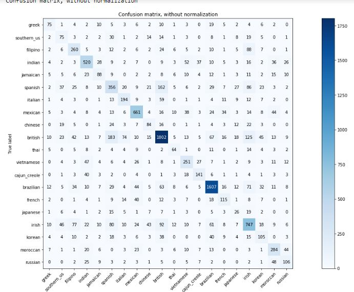
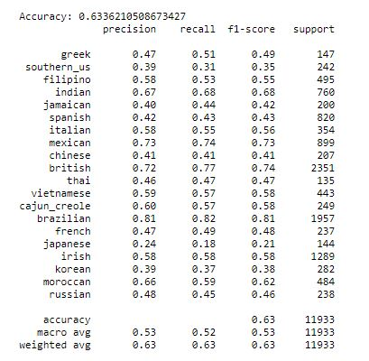

# 2018 下學期 機器學習 期末 project
## 有關 github
1. 沒有帳號的話先去申請一個
2. 把 github ID 跟我說，像我是 HardworkingSnowman
3. 打開 command line 或是 terminal
```
# 先 cd 到想要存放的資料夾
cd "PATH"

# 把 project 複製到資料夾中
git clone https://github.com/HardworkingSnowman/nctu_ML.git
```
4. 每個人都有一個資料夾，資料夾名稱為學號，別改到別人的資料夾的東西
5. 以後當做完一部份，想要更新到 github 上面時
```
sudo git add --all
sudo git commit -m "裡面寫改了什麼，寫什麼都可以"
sudo git push
```

## 開始做作業
### 取得資料(這部分由 0616018 完成)
* 你將會得到幾十萬筆從 ppt 上使用爬蟲抓取的資料，這些資料會有三個欄位。
1. 第一個欄位是 ID，沒什麼重要的，就是 ID，每篇文章的 ID 都不同
2. 第二個欄位是分類，也就是我們要預測的結果
3. 第三個欄位是字詞，把文章的內容分成一個字、兩個字、三個字、四個字分別處理
* ex. 有兩篇文章長這樣 :
```
第一篇 : 我真的好愛你
第二篇 : 柯文哲嗆王世堅
```
| ID  | category | words |
| ------------- | ------------- | ------------- |
| 1 | Boy-Girl | ['我', '真', '的', '好', '愛', '你', '我真', '真的', '的好', '好愛', '愛你', '我真的', '真的好', '的好愛', '好愛你', '我真的好', '真的好愛', '的好愛你'] |
| 2 | Gossiping | ['柯', '文', '哲', '嗆', '王', '世', '監', '柯文', '文哲', '哲嗆', '嗆王', '王世', '世堅', '柯文哲', '文哲嗆', '哲嗆王', '嗆王世', '王世堅', '柯文哲嗆', '文哲嗆王', '哲嗆王世', '嗆王世監'] |

ps.
* 會把文章中的英文字詞刪除，也不會有空格或換行的情形
* 總共 127 個分類，每個分類的文章數會相同

### 整理資料(這部分由全部組員個別完成，5/30 之前)
* 目前能想到的方法是使用 hw3 的 preprocessing 來處理。

### 開始 training(這部分由全部組員個別完成，5/30 之前)
1. 所有組員自己選一種模型去做，選好之後在 FB 上說一下，免得跟別人撞到，另外在自己資料夾下的 README.md 寫上自己是用哪個模型。
2. 把資料分成 trainging data 和 testing data 兩部分
3. 使用自己的模型把 training data 完成，用 train 好的模型去預測 testing data
4. 最後得到的結果至少要有 Confusion matrix、classification report
* Confusion matrix : 



* classification report :



### 寫報告(這部分由全部組員個別完成，6/1 之前)
1. 請寫下使用的模型以及訓練的方法(包含整理資料的部分)
2. 附上 Confusion matrx 和 classification report 的截圖
3. 寫心得
4. 附上參考資料
5. 寫在 md 上。別用 word，不然 mac 開不了。也別轉 pdf，不然有點處理起來有點麻煩。不會用 md 的去 google "git md 教學"

### 彙整報告(這部分由 "還沒決定" 完成，6/3 之前)
* 基本上就是把大家寫完的報告丟到 word 裡面，最後轉成 pdf
* 不過還有動機、心得、參考資料等等，所以之後再分工